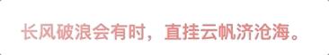

- [1. 基本语法](#1-基本语法)
- [2. 应用](#2-应用)
  - [2.1. 渐变背景](#21-渐变背景)
  - [2.2. 渐变文本](#22-渐变文本)
  - [2.3. 闪烁文本](#23-闪烁文本)
  - [2.4. 波浪线](#24-波浪线)
  - [2.5. 方格背景](#25-方格背景)
  - [2.6. 方格彩带](#26-方格彩带)
  - [2.7. 网格背景](#27-网格背景)
  - [2.8. 配合mask制作转场动画](#28-配合mask制作转场动画)
  - [2.9. 配合`background-blend-mode`制作图片的hover效果](#29-配合background-blend-mode制作图片的hover效果)
  - [2.10. 动态边框](#210-动态边框)
## 1. 基本语法

```css
linear-gradient(direction, color-stop1, color-stop2, ...);
```
- direction	用角度值指定渐变的方向（或角度）。
- color-stop1, color-stop2,...	用于指定渐变的起止颜色。


linear-gradient中度数的意思，0度指向上，45度指向右，不填的话，默认其实是180度，指向下。


## 2. 应用

### 2.1. 渐变背景


核心代码

```css
.gradient-bg {
  background: linear-gradient(135deg, #f66, #f90, #3c9, #09f, #66f) left
    center/400% 400%;
  animation: move 10s infinite;
}
@keyframes move {
  0%,
  100% {
    background-position-x: left;
  }
  50% {
    background-position-x: right;
  }
}
```

### 2.2. 渐变文本


核心代码

```css
.gradient-text {
  background-image: linear-gradient(90deg, #f66, #f90);
  background-clip: text;
  color: transparent;
  animation: hue 5s linear infinite;
}
@keyframes hue {
  from {
    filter: hue-rotate(0);
  }
  to {
    filter: hue-rotate(-1turn);
  }
}
```

`filter: hue-rotate`是[色相旋转](https://developer.mozilla.org/en-US/docs/Web/CSS/filter-function/hue-rotate())，`360度`是一个循环，单位有以下几种：
```css
hue-rotate(90deg)   /* 90度旋转 */
hue-rotate(.5turn)   /* 180度旋转 */
hue-rotate(3.142rad)  /* 3.142弧度旋转，近似一圈，也就是360度 */
```

### 2.3. 闪烁文本



核心代码

```css
.blink-text {
  width: 100%;
  background-image: linear-gradient(-45deg, #f66 30%, #fff 50%, #f66 70%);
  background-size: 200%;
  background-clip: text;
  color: transparent;
  animation: shine 2s infinite;
}
@keyframes shine {
  from {
    background-position: 100%;
  }
  to {
    background-position: 0;
  }
}
```

### 2.4. 波浪线


核心代码

```scss
.waveline {
  position: relative;
  &::after {
    position: absolute;
    left: 0;
    top: 100%;
    width: 100%;
    height: $h;
    background: linear-gradient(
        135deg,
        transparent,
        transparent 45%,
        $color,
        transparent 55%,
        transparent 100%
      ),
      linear-gradient(
        45deg,
        transparent,
        transparent 45%,
        $color,
        transparent 55%,
        transparent 100%
      );
    background-size: $h * 2 $h * 2;
    background-repeat: repeat-x, repeat-x;
    content: "";
  }
}
```

原理是，一个135度的线和一个45度的线交叉，同时`background-size`的宽和高都是`height`的2倍。

### 2.5. 方格背景


核心代码

```css
.square-bg {
  background-image: linear-gradient(
      45deg,
      #eee 25%,
      transparent 25%,
      transparent 75%,
      #eee 75%
    ),
    linear-gradient(45deg, #eee 25%, transparent 25%, transparent 75%, #eee 75%);
  background-position: 0 0, 20px 20px;
  background-size: 40px 40px;
}
```

可以看成由4个小三角组成，左下和右上的为一组，中间的两个是另一组。


### 2.6. 方格彩带


核心代码

```css
.colour-bar {
  width: 500px;
  height: 50px;
  background-image: repeating-linear-gradient(
    90deg,
    #f66,
    #f66 50px,
    #66f 50px,
    #66f 100px
  );
}
```

`repeating-linear-gradient`就是`linear-gradient`的重复。


### 2.7. 网格背景


核心代码：

```html
<div class="grid-bg"></div>
<div class="grid-bg-2"></div>
<div class="grid-bg-3"></div>
```

```css
.grid-bg {
  background-color: #3c9;
  background-image: linear-gradient(0deg, #fff 5%, transparent 5%, transparent),
                    linear-gradient(90deg, #fff 5%, transparent 5%, transparent);
  background-position: 0 0, 20px 20px;
  background-size: 20px 20px;
}
.grid-bg-2 {
  background: #58a;
  background-image: linear-gradient(rgba(255, 255, 255, 0.3) 1px, transparent 0),
                    linear-gradient(90deg, rgba(255, 255, 255, 0.3) 1px, transparent 0),
                    linear-gradient(white 1px, transparent 0),
                    linear-gradient(90deg, white 1px, transparent 0);
  background-size: 15px 15px, 15px 15px, 75px 75px, 75px 75px;
}
.grid-bg-3 {
  background: white;
  background-image: linear-gradient(90deg,rgba(200, 0, 0, 0.5) 50%,transparent 0),
                    linear-gradient(rgba(200, 0, 0, 0.5) 50%, transparent 0);
  background-size: 30px 30px;
}
```

本质是一个0度和一个90度的两条线相交。


### 2.8. 配合mask制作转场动画


核心代码

```scss
.mask {
  background: url($img) no-repeat;
  &::before {
    background: url($img2) no-repeat;
    mask: linear-gradient(45deg, #000 40%, transparent 60%);
  }
}
```

`mask`可以用作[遮罩](https://developer.mozilla.org/zh-CN/docs/Web/CSS/mask)。


### 2.9. 配合`background-blend-mode`制作图片的hover效果


核心代码

```scss
.pic {
  background: url($img), linear-gradient(#f00, #00f);
  background-size: cover, 100% 100%;
  background-position: 0 0, -300px 0;
  background-blend-mode: luminosity;
  transition: 0.5s background-position linear;
  &:hover {
    background-position: 0 0, 0 0;
  }
}
```

[background-blend-mode](https://developer.mozilla.org/zh-CN/docs/Web/CSS/background-blend-mode)定义元素的背景图片，以及背景色如何混合，类似PS中常见的混合模式。


### 2.10. 动态边框


利用了`linear-gradient`可以画线的特点。

核心代码

```css
.dynamic-border {
  background: linear-gradient(0, #f66 2px, #f66 2px) no-repeat left top/0 2px,
              linear-gradient(-90deg, #f66 2px, #f66 2px) no-repeat right top/2px 0,
              linear-gradient(-180deg, #f66 2px, #f66 2px) no-repeat right bottom/0 2px,
              linear-gradient(-270deg, #f66 2px, #f66 2px) no-repeat left bottom/2px 0;
  transition: all 300ms;
  &:hover {
    background-size: 100% 2px, 2px 100%, 100% 2px, 2px 100%;
  }
}
```


